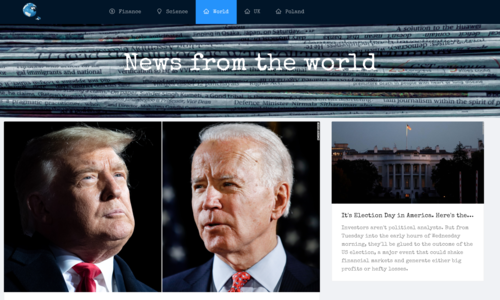
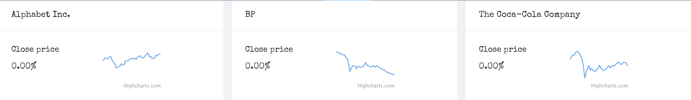
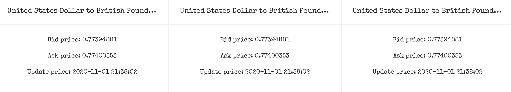
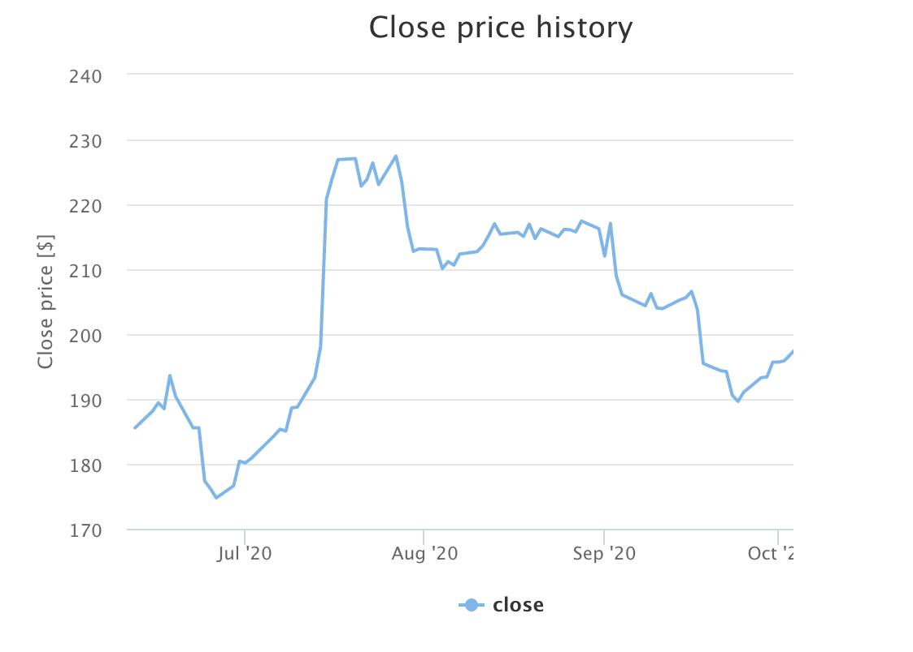
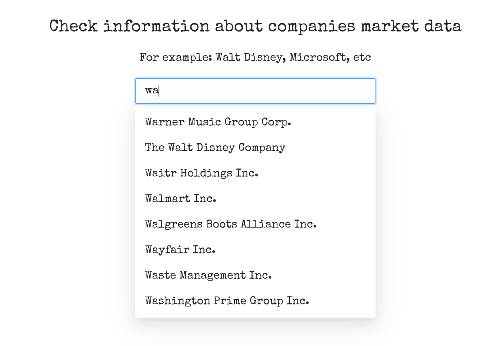

NEWS APP

News app using React, Python as a server side and MongoDB also Ant Design components. App used few APIs- News API, Weatherbit.io API and for finance page- Alpha Vintage API, yahoo finance API. It is also used scraping (from Nature.com). MongoDB is used for better performance data is schedule to be removed on different times depend on collection (with createIndex).
App is mobile responsive.

## Main page:
banner + world news, after clicking on article its redirecting to page

## Finance:
* on the top- 9 companies with auto transition, showing close price and small chart with history stock info 
 
 

* in the middle- currency exchange data

 

* autocomplete search input- after choosing company it showing chart with stock history data (unfortunately its only 5 free request per minute, so can be some issues if user put too many letters or want to check more than one company)

 

## Science:
showing 7 articles from Nature website- on server site info is fetching using scraping method

[picture](img/science.png)

## World:
displaying world info from API, after clicking on article its redirecting to page

[picture](img/world.png)

## UK/ Poland
* weather - displaying info from API with video depending on cast
[picture](img/weather.png)
* news- displaying news info from API, after clicking on article its redirecting to page
[picture](img/news.png)
* sport- redirecting to website with 4 images with different balls (tennis, volleyball, basketball, football)
[picture](img/sport.png) [picture](img/sport-news.png)

## Globe icon:
redirecting to main page